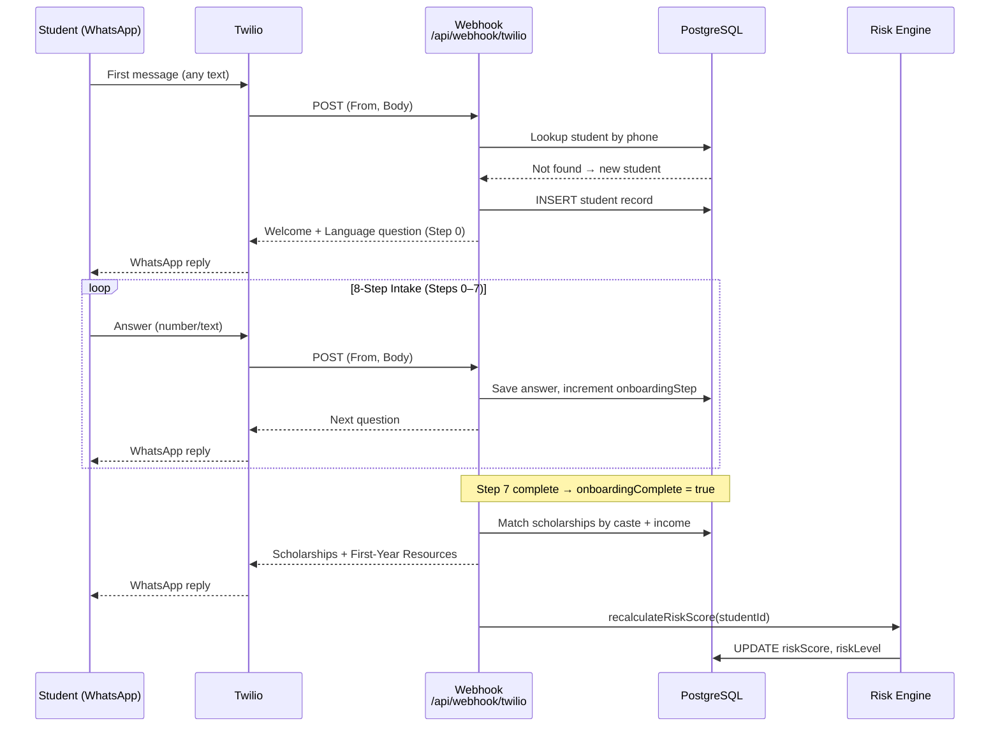
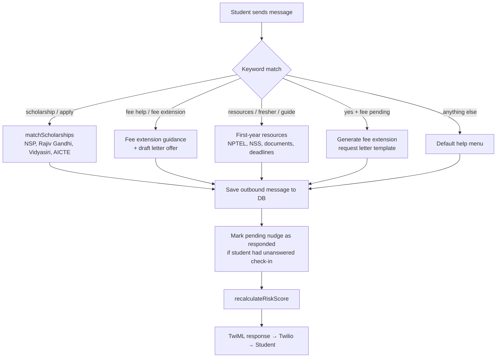
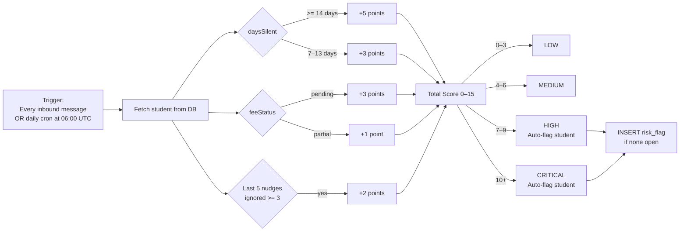
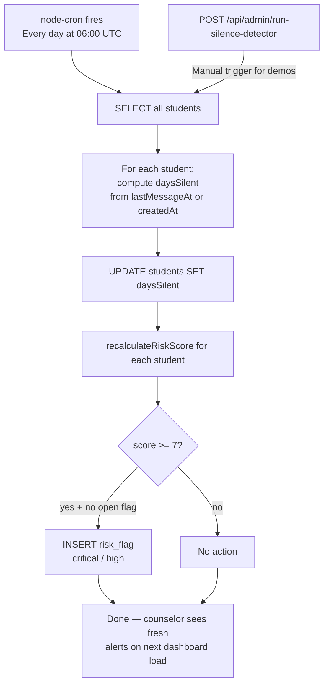
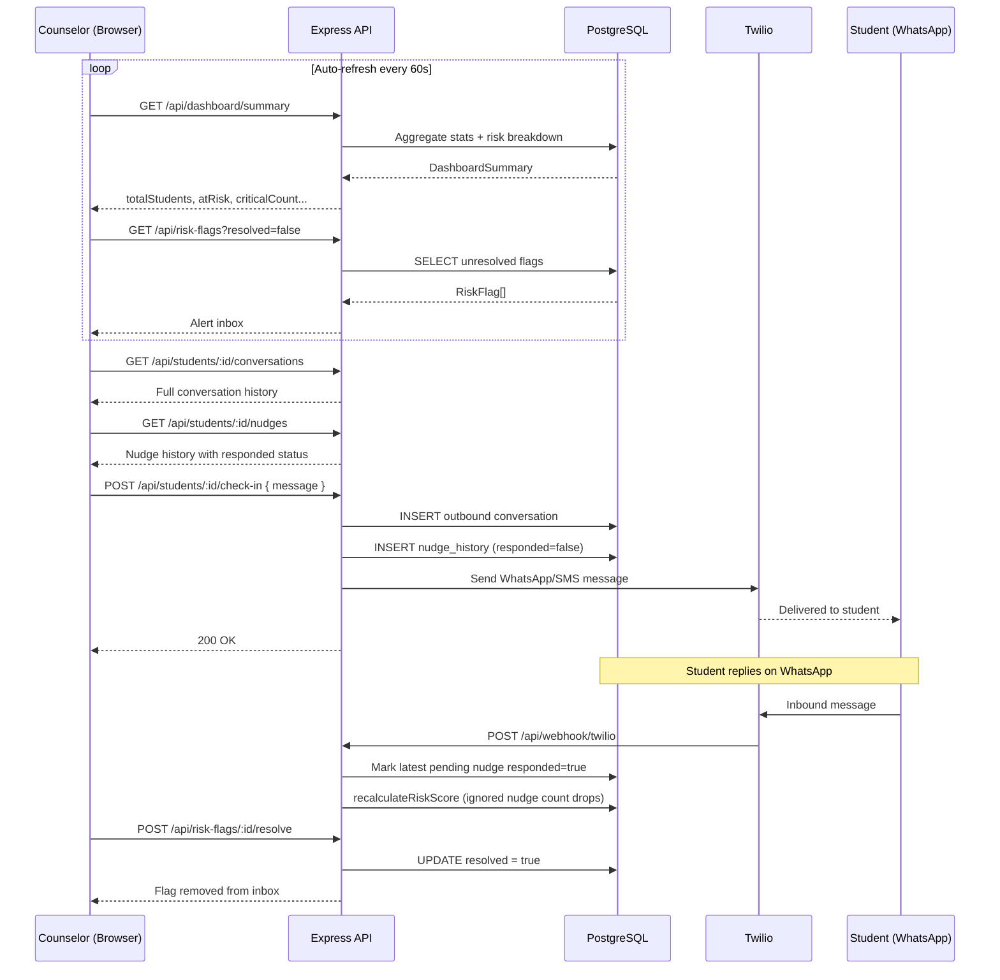

# Disha — दिशा

> AI-powered counselor dashboard for first-generation college students in India.  
> Students onboard via WhatsApp/SMS (no app install). Counselors monitor via a real-time web dashboard.

---

## System Workflow

### 1. Student Onboarding (WhatsApp → Intake Agent)



---

### 2. Knowledge Agent (Post-Onboarding Queries)



---

### 3. Risk Scoring Engine



---

### 4. Daily Silence Detector (Cron Job)



---

### 5. Counselor Dashboard & Nudge Tracking Flow



---

## Tech Stack

| Layer | Technology |
|---|---|
| Runtime | Node.js 24, TypeScript 5.9 |
| Monorepo | pnpm workspaces |
| API Server | Express 5 |
| Database | PostgreSQL + Drizzle ORM |
| Validation | Zod v4 + drizzle-zod |
| API Contract | OpenAPI 3 spec → Orval codegen (React Query hooks + Zod schemas) |
| Build | esbuild (server), Vite (frontend) |
| Frontend | React 18, Vite, Tailwind CSS v4, shadcn/ui |
| Animations | Framer Motion |
| Messaging | Twilio (WhatsApp primary, SMS fallback) |
| Scheduling | node-cron (daily silence detector) |
| Deployment | Replit |

---

## Six Core Features

| # | Feature | Description |
|---|---|---|
| 1 | **Intake Agent** | 8-step WhatsApp onboarding: language → name → college → year/branch → hometown → income → caste → fee status |
| 2 | **Knowledge Agent** | Answers scholarship, fee, and college-life queries post-onboarding |
| 3 | **Scholarship Matching** | Auto-matches NSP, Karnataka Rajiv Gandhi, Vidyasiri, AICTE Pragati based on caste + income profile |
| 4 | **Silence Detector** | Daily cron at 06:00 UTC — recomputes `daysSilent` for every student, refreshes risk scores, auto-creates flags. Manual trigger via `POST /api/admin/run-silence-detector` |
| 5 | **Nudge History Tracker** | Every counselor check-in is recorded with `responded` status. Automatically marked as responded when the student replies on WhatsApp. Feeds into risk score (`ignored nudges ≥ 3 → +2 pts`) |
| 6 | **Counselor Dashboard** | Real-time web dashboard — alert inbox, student profiles, conversation history, nudge history tab with responded/awaiting status, one-click check-in |

---

## API Endpoints

| Method | Path | Description |
|---|---|---|
| GET | `/api/healthz` | Health check |
| GET | `/api/students` | List students (filter by riskLevel, college, search, flagged) |
| GET | `/api/students/:id` | Student profile |
| PATCH | `/api/students/:id` | Update student (feeStatus, flagged) |
| GET | `/api/students/:id/conversations` | Conversation history |
| GET | `/api/students/:id/nudges` | Nudge history with responded status |
| POST | `/api/students/:id/check-in` | Send counselor check-in via WhatsApp/SMS |
| GET | `/api/risk-flags` | List risk flags (filter by resolved, severity) |
| PATCH | `/api/risk-flags/:id/resolve` | Mark a risk flag as resolved |
| GET | `/api/scholarships` | List active scholarship schemes |
| GET | `/api/dashboard/summary` | Dashboard stats + risk breakdown |
| POST | `/api/webhook/twilio` | Twilio inbound message webhook |
| POST | `/api/admin/run-silence-detector` | Manually trigger silence detector |

---

## Risk Score Formula

```
Score = days_silent_score + fee_score + ignored_nudges_score

days_silent >= 14  →  +5
days_silent 7–13   →  +3
fee = pending      →  +3
fee = partial      →  +1
nudges ignored ≥3  →  +2

0–3   → LOW
4–6   → MEDIUM
7–9   → HIGH     (auto-flag)
10+   → CRITICAL  (auto-flag)
```

---

## Running Locally

```bash
# Install deps
pnpm install

# Push DB schema
pnpm --filter @workspace/db run push

# Start API server (port 8080)
pnpm --filter @workspace/api-server run dev

# Start dashboard (port auto-assigned)
pnpm --filter @workspace/disha-dashboard run dev

# Regenerate API hooks after OpenAPI changes
pnpm --filter @workspace/api-spec run codegen

# Manually trigger silence detector (demo / testing)
curl -X POST http://localhost:80/api/admin/run-silence-detector
```

**Required env:**
- `DATABASE_URL` — PostgreSQL connection string
- `TWILIO_ACCOUNT_SID`, `TWILIO_AUTH_TOKEN`, `TWILIO_FROM_NUMBER` — for WhatsApp/SMS
- `SESSION_SECRET` — session signing

**Twilio webhook:** `POST /api/webhook/twilio`  
**WhatsApp Sandbox:** `+14155238886` (join with your sandbox keyword)
